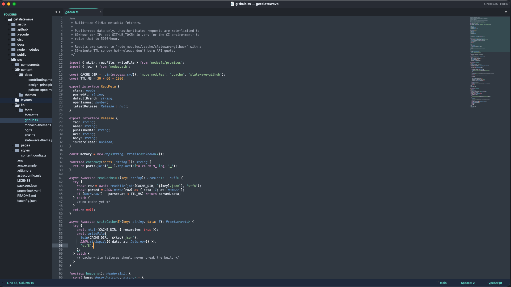

<div align="center">


<picture>
  <source media="(prefers-color-scheme: dark)" srcset="https://getslatewave.com/brand/wordmark-light.png">
  
</picture>

# Slatewave (Sublime Text)

A dark [Sublime Text](https://www.sublimetext.com) theme — **color scheme and UI theme** — built around a slate foundation and a teal signature, with sky / rose / purple / amber accents. Part of the [Slatewave family](#slatewave-family) — one palette across editors, terminals, prompts, notes, and more.

> _Slate below, teal above._



</div>

---

## What's in the box

| File | Purpose |
|---|---|
| `Slatewave.sublime-color-scheme` | Syntax highlighting — editor colors, scopes, semantic tokens |
| `Slatewave.sublime-theme` | UI chrome — sidebar, tabs, status bar, quick panel, auto-complete, scrollbar |
| `slatewave.py` + `Default.sublime-commands` | One-shot `Slatewave: Activate Color Scheme & Theme` palette command |

Both are required for the full experience, but the color scheme works standalone if you prefer a different UI theme.

---

## Palette

### Foundation — slate

The editor, sidebar, and panels all live in the slate scale. Five steps, darkest to lightest.

| | Hex | Tailwind | Where |
|---|---|---|---|
|  | `#020617` | slate-950 | — (reserved for future elements) |
|  | `#0f172a` | slate-900 | overlay surround |
|  | `#1e293b` | slate-800 | status bar, auto-complete, quick panel |
|  | slate-chrome | sidebar, tab strip, scrollbar |
|  | slate-editor | editor surface, active tab, panels |
|  | `#334155` | slate-700 | selected rows, borders |
|  | `#475569` | slate-600 | scrollbar puck, ignored files |

### Text — slate (inverse)

| | Hex | Tailwind | Where |
|---|---|---|---|
|  | `#64748b` | slate-500 | comments, line numbers |
|  | `#94a3b8` | slate-400 | operators, inactive tabs |
|  | `#cbd5e1` | slate-300 | parameters, properties, sidebar labels |
|  | `#e2e8f0` | slate-200 | default foreground |
|  | `#f1f5f9` | slate-100 | (bright ANSI white) |

### Signature — teal

The "wave" in Slatewave. Primary accent across the editor and UI chrome.

| | Hex | Tailwind | Where |
|---|---|---|---|
|  | `#0f766e` | teal-700 | default button background |
|  | `#5eead4` | teal-300 | **primary accent** — cursor, active tab underline, strings, status bar text, selected sidebar row, selection |
|  | `#99f6e4` | teal-200 | types, classes, interfaces, inline code |
|  | `#ecfeff` | cyan-50 | text on teal button backgrounds |

### Accents

Each accent maps to a role consistent with every other Slatewave theme.

| | Hex | Role |
|---|---|---|
|  | `#38bdf8` | keywords, tags, info diagnostics, links |
|  | `#7dd3fc` | functions, JSON/YAML keys, CSS properties, auto-complete kind labels |
|  | `#B388FF` | storage (`const`/`let`/`function`), `this`/`self`, attributes, submodules |
|  | `#fb7185` | numbers, constants, modified files, dirty tab indicator, errors |
|  | `#fbbf24` | decorators, escape chars, staged files, warnings |
|  | `#b45309` | deprecated symbols |
|  | `#0e7490` | dark cyan ANSI |
|  | `#ff4500` | unmerged files, merge conflicts |
|  | `#ef5350` | deleted files, invalid syntax |

---

## Syntax mapping

| Token | | Color | Style |
|---|---|---|---|
| Comments |  | `#64748b` | italic |
| Keywords (`if`, `return`, `import`) |  | `#38bdf8` | — |
| Storage (`const`, `let`, `function`, `class`) |  | `#B388FF` | italic |
| Types / classes / interfaces |  | `#99f6e4` | — |
| Functions (calls + definitions) |  | `#7dd3fc` | — |
| Strings |  | `#5eead4` | — |
| Numbers, booleans, `null`, `undefined` |  | `#fb7185` | — |
| Constants (`UPPER_SNAKE`) |  | `#fb7185` | — |
| Regex |  | `#fb7185` | — |
| Escape sequences |  | `#fbbf24` | — |
| Decorators / annotations |  | `#fbbf24` | italic |
| `this` / `self` / `super` |  | `#B388FF` | italic |
| Parameters |  | `#cbd5e1` | italic |
| Properties / object keys |  | `#cbd5e1` | — |
| Operators, punctuation |  | `#94a3b8` | — |
| HTML/JSX tags |  | `#38bdf8` | — |
| HTML/JSX attributes |  | `#B388FF` | italic |
| CSS selectors |  | `#5eead4` | — |
| CSS properties |  | `#7dd3fc` | — |
| CSS custom properties (`--var`) |  | `#B388FF` | — |
| CSS pseudo selectors |  | `#fbbf24` | — |
| Markdown headings |  | `#5eead4` | bold |
| Markdown links |  | `#38bdf8` | underline |
| Markdown inline code |  | `#99f6e4` | — |
| Diff inserted |  | `#5eead4` | — |
| Diff deleted |  | `#fb7185` | — |

---

## Installation

### Package Control (once listed)

1. `⌘⇧P` / `Ctrl+Shift+P` → `Package Control: Install Package`
2. Pick **Slatewave**
3. `⌘⇧P` / `Ctrl+Shift+P` → **Slatewave: Activate Color Scheme & Theme**

### Manual

Clone into your Sublime `Packages` directory:

```sh
# macOS
git clone https://github.com/kevinlangleyjr/sublime-text-slatewave.git \
  "$HOME/Library/Application Support/Sublime Text/Packages/Slatewave"

# Linux
git clone https://github.com/kevinlangleyjr/sublime-text-slatewave.git \
  "$HOME/.config/sublime-text/Packages/Slatewave"

# Windows
git clone https://github.com/kevinlangleyjr/sublime-text-slatewave.git ^
  "%APPDATA%\Sublime Text\Packages\Slatewave"
```

Then activate via:

- **Preferences → Select Color Scheme…** → `Slatewave`
- **Preferences → Select Theme…** → `Slatewave`

Or use the bundled command palette entry: `Slatewave: Activate Color Scheme & Theme`.

---

## Customize

To tweak without forking, add overrides to your user color scheme (`Preferences → Customize Color Scheme`):

```json
{
    "rules":
    [
        {
            "scope": "comment",
            "foreground": "#475569"
        }
    ]
}
```

For UI theme overrides (`Preferences → Customize Theme`):

```json
{
    "rules":
    [
        {
            "class": "tab_control",
            "attributes": ["selected"],
            "layer2.tint": "#99f6e4"
        }
    ]
}
```

---

## Slatewave family

One palette. Every tool.

- **Editors** — [VSCode](https://github.com/kevinlangleyjr/vscode-slatewave) · [Neovim](https://github.com/kevinlangleyjr/neovim-slatewave) · [Helix](https://github.com/kevinlangleyjr/helix-slatewave) · [Zed](https://github.com/kevinlangleyjr/zed-slatewave) · [JetBrains](https://github.com/kevinlangleyjr/jetbrains-slatewave)
- **Terminals** — [Alacritty](https://github.com/kevinlangleyjr/alacritty-slatewave) · [Ghostty](https://github.com/kevinlangleyjr/ghostty-slatewave) · [iTerm2](https://github.com/kevinlangleyjr/iterm2-slatewave) · [WezTerm](https://github.com/kevinlangleyjr/wezterm-slatewave) · [Windows Terminal](https://github.com/kevinlangleyjr/windows-terminal-slatewave)
- **Prompts** — [Oh My Posh](https://github.com/kevinlangleyjr/slatewave-omp) · [Starship](https://github.com/kevinlangleyjr/starship-slatewave)
- **Multiplexer** — [tmux](https://github.com/kevinlangleyjr/tmux-slatewave)
- **CLI** — [LSD](https://github.com/kevinlangleyjr/lsd-slatewave)
- **Notes** — [Obsidian](https://github.com/kevinlangleyjr/obsidian-slatewave) · [Logseq](https://github.com/kevinlangleyjr/logseq-slatewave) · [MarkEdit](https://github.com/kevinlangleyjr/markedit-slatewave)
- **Launchers** — [Alfred](https://github.com/kevinlangleyjr/alfred-slatewave) · [Raycast](https://github.com/kevinlangleyjr/raycast-slatewave)
- **Chat** — [Slack](https://github.com/kevinlangleyjr/slack-slatewave)

See [getslatewave.com](https://getslatewave.com) for the full family.
---

## Contributing

Issues and PRs welcome. For palette tweaks, please include a before/after screenshot of the same file so the visual tradeoff is obvious.

---

## License

WTFPL – Do What The Fuck You Want To Public License. See [LICENSE](LICENSE).
